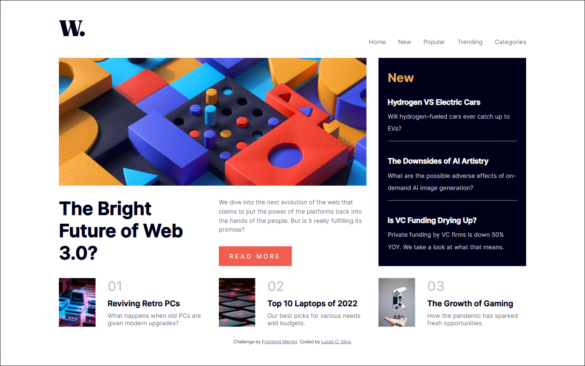
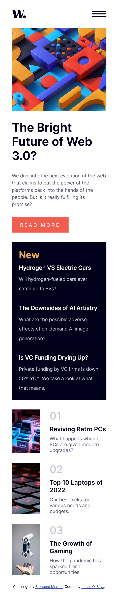

# Frontend Mentor - News homepage solution

This is a solution to the [News homepage challenge on Frontend Mentor](https://www.frontendmentor.io/challenges/news-homepage-H6SWTa1MFl). Frontend Mentor challenges help you improve your coding skills by building realistic projects. 

## Table of contents

- [Overview](#overview)
  - [The challenge](#the-challenge)
  - [Screenshot](#screenshot)
- [My process](#my-process)
  - [Built with](#built-with)

## Overview

The main objective I had for this project was to learn and use grid since I had never done that before.

### The challenge

Users should be able to:

- View the optimal layout for the interface depending on their device's screen size
- See hover and focus states for all interactive elements on the page
- **Bonus**: Toggle the mobile menu (requires some JavaScript)

### Screenshot

## My process

I started with the grid layout trying to match the design as well as I could and trying to figure out the semantical divs I'd use. After I had the basic layout and the semantical parts sorted I started filling in each part from top to bottom with the html and css, after the Desktop top desing were finished I started working on the mobile version. At the end I did the mobile menu and it's Script. 

### Built with

- Semantic HTML5 markup
- CSS custom properties
- Flexbox
- CSS Grid
